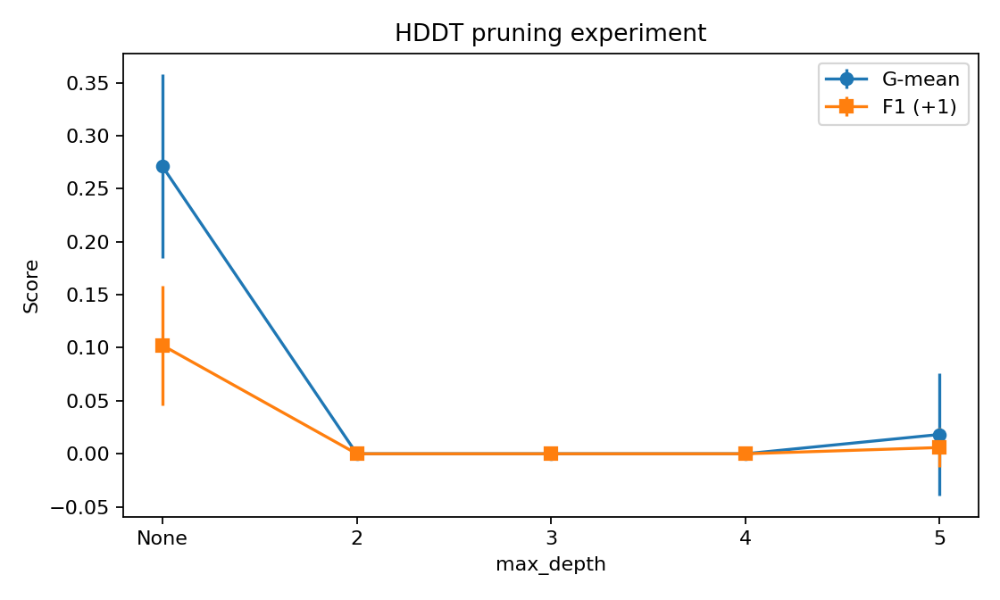

# Homework 2 — Ensemble Learning for Imbalanced Classification

## Overview

Custom trees and ensembles examine minority-class detection on a strongly imbalanced COVID-19 severity dataset.

## Objectives

No separate instructor assignment is present. The report describes three tasks: HDDT depth limits; balanced-subset bagging with HDDT/CART comparison; and AdaBoost.M1 with/without SMOTE across boosting rounds. Theory questions discuss split criteria and ensembles. These are reported requirements, not independently checked against the original prompt.

## Implemented approach

Each stratified 70/30 split uses training-only median/mode imputation, Kendall-correlation filtering, and continuous-feature scaling. Experiments repeat seeds 0–9. HDDT is custom recursive code. Bagging bootstraps minority samples and undersamples the majority, then votes. Custom AdaBoost.M1 uses scikit-learn decision stumps; custom SMOTE interpolates training minority neighbors. Metrics include positive-class precision, recall, F1, ROC AUC and G-mean.

## Repository structure

| Path | Purpose |
| --- | --- |
| [report.pdf](report.pdf) | Submitted report |
| [ML_HW2_Ensemble_Learning_Report.docx](ML_HW2_Ensemble_Learning_Report.docx) | Editable report |
| [code/run_all.py](code/run_all.py) | Experiment entry point |
| [code/common.py](code/common.py) | Preprocessing/metrics |
| [code/task1_hddt.py](code/task1_hddt.py) | Hellinger tree |
| [code/task2_bagging.py](code/task2_bagging.py) | Balanced bagging |
| [code/task3_adaboost.py](code/task3_adaboost.py) | AdaBoost/SMOTE |
| [code/requirements.txt](code/requirements.txt) | Existing dependencies |
| [code/Covid.csv](code/Covid.csv) | Patient-feature input; review rights |
| [results/](results/) | Saved metrics |
| [figures/](figures/) | Saved plots |

## Requirements

Python. Existing code/requirements.txt lists NumPy, pandas, Matplotlib, seaborn, scikit-learn and python-docx without versions. Pandas Kendall correlation may also need SciPy, absent from that file. Compatibility was not tested.

## Input data

code/Covid.csv contains 1,585 rows, 40 features, and Label; CSV inspection confirms 100 +1 and 1,485 −1 labels. Collection provenance, consent and redistribution permission are not supplied.

## Running the project

Commands are **inferred and untested**. Use a disposable copy because run_all.py writes results/ and figures/. Obtain permission for the dataset. From the repository root:

```bash
cd 2/code
python -m pip install -r requirements.txt
# May be needed for pandas Kendall correlation:
python -m pip install scipy
python run_all.py
```

Individual scripts accept a positional dataset path, for example python task1_hddt.py Covid.csv; they also write results. No training was executed.

## Results

Saved unrestricted-HDDT mean minority F1 is 0.1023 and G-mean is 0.2710 over ten seeds. AdaBoost+SMOTE mean F1 is 0.1360 at 50 rounds and 0.1431 at 100 in the CSV. The report’s best comparison entry by F1 is CART bagging at T=51 (0.1467). These saved results illustrate accuracy/recall tradeoffs and limited minority detection; none were reproduced.



[Saved metrics](results/) · [Other figures](figures/)

## Assignment materials

- [Submitted report](report.pdf)
- [Implementation](code/)
- Original instructor assignment: not found.

## Notes and limitations

Report prose says SMOTE F1 is highest at T=50, but its table/CSV show T=100. It claims CART bagging has the highest comparison AUC, whereas HDDT bagging has 0.6704 versus CART’s 0.6409. Originals remain unchanged. Original instructor requirements and dataset provenance are unresolved. Patient features require privacy review; report PDF/DOCX contain identifiers. Scripts overwrite result/figure directories, so reproduce in isolated copies.

## Academic context

Completed as part of a master's-level Machine Learning course; documented for portfolio and educational use. See the [root README](../README.md) for attribution and [license notice](../LICENSE-NOTICE.md) for ownership.
