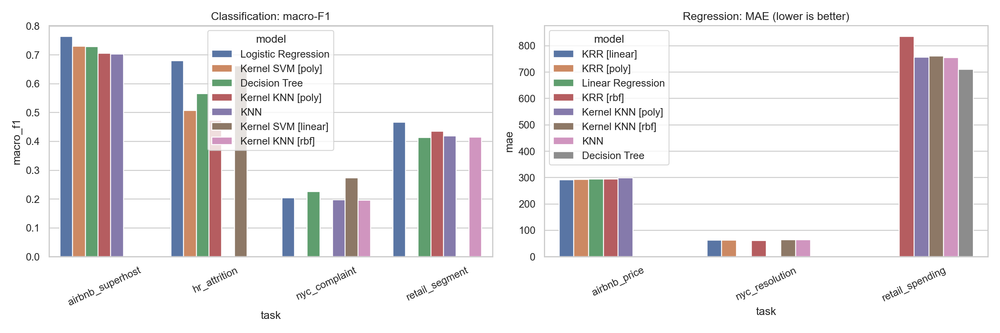

# Homework 3 — Kernel and Non-Kernel Learning Under Real-World Data Imperfections

## Overview

Seven classification/regression tasks compare custom estimators across Airbnb, NYC 311, IBM HR and Online Retail, with quality, failure, bias and computation diagnostics.

## Objectives

No separate instructor prompt is present. The report/notebook investigate missingness, outliers, redundancy, leakage, label quality, kernel geometry, prediction failures, group reliability and exact-kernel complexity. The notebook mentions a 20–35-page paper; the supplied PDF has 18 pages. Original requirement compliance cannot be verified.

## Implemented approach

The notebook engineers listing, service-request, employee and future-customer tables. It uses host-disjoint Airbnb splits, chronological NYC splits, a fixed stratified HR split and future-defined retail targets. Train-only preprocessing imputes medians, scales by median/IQR, clips numeric values to [−20,20], and encodes bounded categories. NumPy/SciPy models include logistic/linear regression, KNN, CART-style trees, squared-hinge kernel SVM with Adam, KRR, kernel KNN, and KPCA plus logistic regression. Isolation forest supports anomaly diagnostics. Most train sets are capped to 420–800 rows; HR retains 1,103. Metrics, geometry, timing, group errors and failure cases are saved.

## Repository structure

| Path | Purpose |
| --- | --- |
| [ML_Homework_Complete.ipynb](ML_Homework_Complete.ipynb) | 53-cell workflow/narrative |
| [src/scratch_ml.py](src/scratch_ml.py) | Custom models/preprocessing/diagnostics |
| [src/homework_experiments.py](src/homework_experiments.py) | Preparation/orchestration |
| [processed/model_tables/](processed/model_tables/) | Engineered inputs/audits |
| [artifacts/model_results.csv](artifacts/model_results.csv) | 60 saved experiments |
| [artifacts/](artifacts/) | Saved diagnostics/results/plots |
| [cache/](cache/) | NYC sample/population metadata |
| [report.pdf](report.pdf) | 18-page submitted study |

## Requirements

Python (modern union annotations), Jupyter, NumPy, pandas, SciPy, Matplotlib and seaborn. XLSX reading needs a compatible Excel engine such as openpyxl; that suggestion is untested. No pinned environment is supplied.

## Input data

Saved tables contain 19,296 Airbnb price and 22,936 superhost rows; 34,283 NYC classification and 32,755 regression rows; 1,103 HR train and 367 test rows; and 3,317 future-target retail customers. CSV counts are checked. Four raw sources are absent. The report’s roughly 2.8 GB NYC snapshot is not present here.

## Running the project

**Manual notebook workflow, untested:** use an isolated copy of 3/. Obtain licensed raw sources under data/ named exactly:

- Merged_Airbnb_Listings.csv
- NYC_311_Service_Requests_from_2023_to_Present.csv
- IBM_HR_Employee_Attrition.csv
- Online_Retail.xlsx

Install observed packages, launch Jupyter from 3/, and open ML_Homework_Complete.ipynb. It writes processed tables, cache and artifacts and may perform costly processing. Raw files are absent here.

**Inferred experiment-only alternative, untested:** from 3/ in an isolated copy, reuse processed tables:

```bash
python -c "from src.homework_experiments import load_prepared_tasks, run_all_experiments; run_all_experiments(load_prepared_tasks(), output_dir='artifacts_reproduction')"
```

This trains models and produces orchestration outputs, not all notebook cleaning/resampling/bias analyses. Source modules are libraries, not standalone CLI entry points. No coursework was executed.

## Results

artifacts/model_results.csv contains 60 model/task rows across seven tasks. Saved NYC complaint macro-F1 is 0.2738 for linear-kernel SVM versus 0.2254 for the decision tree; RBF KRR resolution MAE is 60.90 hours. Logistic regression macro-F1 is 0.7637 for superhost, 0.6805 for attrition and 0.4659 for retail segments. Retail decision tree MAE is 710.30 in the report’s monetary units. These are saved controlled-subset results, not fresh validation or universal rankings.



[Saved metrics](artifacts/model_results.csv) · [Kernel geometry](artifacts/kernel_geometry.csv)

## Assignment materials

- [Submitted report](report.pdf)
- [Implementation](src/)
- Original instructor assignment: not found.

## Notes and limitations

All 53 notebook cells lack saved output objects; CSV/PNG results exist separately. Four raw data/ inputs and referenced LaTeX report/ sources are absent. The PDF has unresolved citations/cross-references. Classification “worst ten” are the first ten wrong rows, not a confidence/loss ranking. Best models are selected on the reporting holdout, with no separate validation set or uncertainty analysis. tracemalloc undercounts native memory. Processed data retain identifiers/locations; the cached pickle was not deserialized. Review source rights/privacy.

## Academic context

Completed as part of a master's-level Machine Learning course; documented for portfolio and educational use. See the [root README](../README.md) for attribution and [license notice](../LICENSE-NOTICE.md) for ownership.
